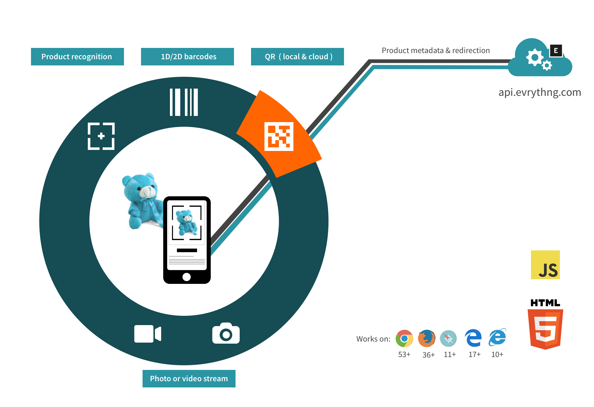

# scanthng.js



`scanthng.js` is a plugin to be used with the
[evrythng.js](https://github.com/evrythng/evrythng.js)
Web SDKs to quickly and easily identify products stored in the EVRYTHNG
Platform via 1D, 2D barcodes or image recognition.

With `scanthng.js` there is no need to use a native mobile application to scan
tags such as QR or EAN/UPC codes on products, or to recognize products in images -
it works directly from any supported browser!

In addition to simply decoding QR codes, more than 20 barcode types can also be
decoded. Identification of products from pre-submitted training image is also
supported (see [_Image Recognition_](#image-recognition) below) which avoids the
need for barcodes altogether. Both single image and video stream scanning is
also offered, applicable for all kinds of scanning use-cases.

## Contents

* [Installation](#installation)
* [Demo App](#demo-app)
* [Account Setup](#account-setup)
* [Product Setup](#product-setup)
* [Application Setup](#product-setup)
* [Scan a Single Photo](#scan-a-single-photo)
* [Scan a Camera Stream](#scan-a-camera-stream)
* [Scan a QR code value only](#scan-a-qr-code-value-only)
* [Image Recognition](#image-recognition)
* [Full Scan Options](#full-scan-options)
* [Example Scenarios](#example-scenarios)


## Installation

In addition to the instructions below, make sure to also install the
[evrythng.js](https://github.com/evrythng/evrythng.js) (or
[evrythng-extended.js](https://github.com/evrythng/evrythng-extended.js)) SDKs
according to their instructions.


### npm

Install the `scanthng` npm module:

```
npm i -D scanthng
```

Include using a script tag:

```html
<script src="./node_modules/scanthng/dist/scanthng.js"></script>
```


### CDN Distribution

Add the script tag to your HTML page, specifying the version you will use:

```html
<script src="https://d10ka0m22z5ju5.cloudfront.net/js/scanthng/4.7.1/scanthng-4.7.1.js"></script>
```

### Supported Devices

The following browsers are currently supported by `scanthng.js`, based on
support for [`getUserMedia()`](https://caniuse.com/#feat=stream).

- Chrome 53+
- Safari 11+
- Firefox 36+
- Edge 17+
- Firefox for Android 62+
- Safari for iOS 11+
- IE 10+ (except `scanStream()`)


## Demo App

Check out our [`scanthng.js` demo app](https://scanthng-demo.evrythng.io) to see
how barcode scanning works in the browser on desktop and mobile devices. You can 
use the example Application API Key or your own key to test scanning all the 
supported barcode types. Scan the QR code below to open the demo app on your 
phone:


## Account Setup

`scanthng.js` is designed for recognition of EVRYTHNG products and Thngs via the
[Identifier Recognition API](https://developers.evrythng.com/reference#identifier-recognition).

Before using this can be done you will need:

- An [EVRYTHNG Dashboard](https://dashboard.evrythng.com) account.
- A project and application within that account.
- One or more products or Thngs that have redirections and `identifiers` set.
  See
  [_Enabling Recognition_](https://developers.evrythng.com/v3.0/reference#section-enabling-recognition)
  to learn how to set up your products.


## Product Setup

In order to be recognised when scanned, an EVRYTHNG product or Thng must have a
redirection setup and optionally some `identifiers` to associate it with
barcodes such as DataMatrix or UPC/EAN 13 etc.


### QR Codes

When a product or Thng has a
[redirection](https://developers.evrythng.com/v3.0/reference#redirections) set,
the resulting short URL is shown in the Dashboard as a QR code (this can also be
[generated via the API](https://developers.evrythng.com/v3.0/reference#section-generate-a-qr-code)
if needed).

After this is done, `scanthng.js` can be used to scan for this QR code when it
is printed on a product using either `scan()` or `scanStream()` methods (see
below).


### Product Identifiers

In addition to the QR code generated when a product or Thng redirection is set,
`scanthng.js` can also be used to identify other kinds of barcode, through
various combinations of the `method` and `type` parameters in the `filter`
option (see [_Scan a Single Photo_](#scan-a-single-photo) as an example).

This recognition will only occur if the `type` specified is defined in the
product or Thng's `identifiers`. For example, to associate a DataMatrix code
`4389676390` with a product, it should contain the appropriate identifier:

```
{
  "name": "Example Product",
  "identifiers": {
    "dm": "4389676390"
  }
}
```

The full range of `method` and `type` parameters are listed below:


**`method: 2d`**

`type`s available:
- dm
- qr_code

**`method: 1d`**

`type`s available:
- codabar
- code_11
- code_39
- code_93
- code_128
- ean_8
- ean_13
- industr_25
- itf
- rss_14
- rss_expanded
- rss_limited
- upc_a
- upc_e

**`method: digimarc`**

`type`s available:
- `gs1:01` - Watermarks containing GTIN match to `gs1:01` product identifiers.
- `gs1:21` - Watermarks containing Serial or Extra data match to `gs1:21` Thng identifiers.
- `serialized` - Watermarks containing GTIN and Serial/Extra Data. Same as `gs1:21`, except Thng and product are both verified as linked. 
- `discover` - Watermarks containing a 'discover-type' payload match to `digimarc:discover` Thng identifiers.

When scanning with `method: digimarc`, the following `imageConversion`
configuration in `option` is recommended, and will be used if not specified
explicitly:

```js
imageConversion: {
  greyscale: false,
  exportFormat: 'image/jpeg',
  resizeTo: 1080,
  exportQuality: 0.85,
}
```

Additionally, make use of pre-imported discover.js with the `useDiscover`
option to only send frames to the API when there is a high chance of decoding
a Digimarc watermark. You can also get notified when detection results are
available:

```js
useDiscover: true,
onDiscoverResult: (detected, rawResult) => console.log(detected),
```

> If `useDiscover` is enabled, make sure you also include discover.js itself.


## Application Setup

After the HTML page containing the `<script>` tags is loaded, the first step is
to create an `Application` scope representing the EVRYTHNG application.

> An Operator scope may also be used, but the `createAnonymousUser` option will
> not be available.

```js
// Use this plugin with evrythng.js via the ScanThng global value
evrythng.use(ScanThng);

const APPLICATION_API_KEY = 'lyBVbCXyieBYjiWde9...';

// Create an application scope
const app = new evrythng.Application(APPLICATION_API_KEY);
```

This `app` will be able to identify all Thngs and products that are visible in
its [project scope](https://developers.evrythng.com/v3.0/docs/scoping).


## Scan a Single Photo

**Note: Due to browser security features, the `scan()` or `scanStream()` methods
(without supplied image) Base64 data must be called as a result of a user
action - a click event handler or similar.**

Use the `scan()` method on an `App` scope to scan for a barcode or QR code. This
method will use either the device's camera app, or a file browser depending on
what is available.

```js
app.scan({
  // Specify the code type to be identified
  filter: { method: '2d', type: 'qr_code' },
})
  .then(res => console.log(`Results: ${JSON.stringify(res)}`))
  .catch(err => console.log(err));
```

If photo data is already obtained, the raw Base64 format data can also be
scanned without taking a new photo:

```js
// Image converted to Base64 from disk or Canvas
const base64 = 'data:image/jpeg;base64,/9j/4AAQSkZJRgABAQE...';

// Scan the data
app.scan(base64)
  .then(res => console.log(`Results: ${JSON.stringify(res)}`))
  .catch(err => console.log(err));
```

See the
[_Matching and Response_](https://developers.evrythng.com/v3.0/reference#section-matching-and-response)
section to see the expected response format. Both recognised Thngs/products and
metadata about the scan attempt is returned.


## Scan a Camera Stream

For a more seamless user experience, we recommend scanning for barcodes from a
device's camera stream, similar to the default experience in modern mobile
barcode scanners including Google Lens and the iOS Camera app. This is achieved
simply by using the `scanStream()` method instead of `scan()`, with a slightly
different HTML page structure.

This method uses [`jsQR.js`](https://github.com/cozmo/jsQR) to scan a video
stream for **QR codes** locally in the browser via the native
[`getUserMedia()`](https://developer.mozilla.org/en-US/docs/Web/API/MediaDevices/getUserMedia)
Web API. To use the `scanStream()` method, make sure you add this library to 
your project and include it with a `<script>` tag, for example:

```html
<script src="./lib/jsQR/jsQR.js"></script>
```

The developer must supply the `id` of a container such as a `<div>` that the SDK
can insert the camera viewfinder `<video>` element into. This `<video>` should
be styled as desired to fit the application experience.

```html
<div id="stream_container">
</div>
```

This container is then used when calling `scanStream()`. The results are in the
same format as for the `scan()` method.

```js
app.scanStream({
  filter: { method: '2d', type: 'qr_code' },
  containerId: 'stream_container',
  interval: 300,
})
  .then(console.log)
  .catch(console.log);
```

**Note: specifying other `method` and `type` combinations to `method=2d` and
`type=qr_code` will still use the camera stream, but will query the web API
instead of analysing the image locally, and at a slower rate by default
(300ms vs 2000ms). The minimum scan rate for non-native scanning is 500ms.**


## Scan a QR code value only

If all you want to do is scan a QR code for a string representation, and do not
require any kind of lookup of the corresponding Thng or product in the EVRYTHNG
Platform, use the `scanQrCode()` method. This is similar to `scanStream()`
available from an `Application` scope (see above), but doesn't communicate
with the Platform to enrich the results.

The developer must supply the `id` of a container such as a `<div>` that the SDK
can insert the camera viewfinder `<video>` element into. This `<video>` should
be styled as desired to fit the application experience.

```html
<div id="stream_container">
</div>
```

This container is then used when calling `scanQrCode()`. The result is a single
string decoded from the observed QR code.

```js
ScanThng.scanQrCode('stream_container')
  .then(console.log)
  .catch(console.log);
```

The scanner can be stopped at any time:

```js
ScanThng.stopScanQrCode();
```


## Image Recognition

Image recognition allows you to recognize Products simply by taking a picture of
the product itself. You can activate the image recognition functionality for any
product through the Dashboard by clicking on "Setup image recognition" on that
product's details page and uploading your reference images.

Once this is set up, scan using the `ir` `method`:

```js
const filter = ;

// Scan for products that match the training images
app.scan({
  filter: { method: 'ir', type: 'image' },
})
  .then(console.log)
  .catch(console.log);
```


## Showing a Spinner

Using [spin.js](http://spin.js.org)

```js
// use your custom id instead of 'spinner'
var spinner = new Spinner().spin(document.getElementById('spinner'));

app.scan()
  .then(console.log)
  .catch(console.log)
  .then(() => spinner.stop());
```


## Full Scan Options

This list details all of the available `options` values that can be passed to
`scan()` or `scanStream()` when performing a scan.


### `filter`
Type: `String` or `Object`

There are different identifier types available for each scanning method. You can
easily filter out matches based on `method` or `type`. If `filter` option is not
provided, both are detected automatically. Results are always ordered by score
(highest first).

```js
// As an object
filter: { method: '2d' },

// as a string
filter: 'method=2d',

// as an array
filter: {
  method: ['2d', 'ir'],
}

// as a string list
filter: 'method=2d,ir'
```


#### `filter.method`
Type: `String`

Available methods: `2d`, `1d`, `ir`, and `ocr` (beta).

```js
filter: {
  method: '2d',
}
```


#### `filter.type`
Type: `String`

Full list of `type` values is shown under
[_Product Identifiers_](#product-identifiers).

```js
filter: {
  type: 'qr_code'
}
```

**NOTE:** When using `filter.type`, `filter.method` is irrelevant. When using
both, `type` must fit the `method` chosen.


### `debug`
Type: `Boolean` Default: `false`

Include debug information in response.


### `perPage`
Type: `Integer`

Max number of matches in response. To only get the best result, use `perPage: 1`.


### `imageConversion`
Type: `Object`

Specifies optional constraints for how a single image scan photo is processed
before being sent to the API. Does not apply for stream scanning.

```js
imageConversion: {
  greyscale: Boolean,
  resizeTo: Integer,
  exportQuality: Float,
  exportFormat: String
}
```


#### `imageConversion.greyscale`
Type: `Boolean` Default: `true`

Indicates whether the library should send a black and white version of the
scanned image for identification. If you do not need to distinguish similar
images with different colors, this yields better and faster results.


#### `imageConversion.resizeTo`
Type: `Integer` Default: `600` Range: `144..`

Sets the maximum *smaller* dimension of the image (in pixels, automatically
resized) to be sent to the server for recognition. The best trade-off between
speed and quality is currently around 600.


#### `imageConversion.exportQuality`
Type: `Integer` Default: `0.8` Range: `0..1`

Sets the quality of exported image in relation to the original (1 being the
original quality).


#### `imageConversion.exportFormat`
Type: `String` Default: `image/png`

Sets the format of exported image, possible values are `image/png` and
`image/jpeg`.


### `invisible`
Type: `Boolean` Default: `true`

If enabled, hides the `<input type=file>` element used to prompt for file
upload.


### `offline`
Type: `Boolean` Default: `false`

If enabled, will not attempt to resolve the scanned URL as an EVRYTHNG resource,
but instead return a similar response with only the `meta.value` data set, which
will contain the raw scanned string value.

Note: If this option is enabled, no `implicitScans` action will be created via
the normal URL resolution process.


### `createAnonymousUser`
Type: `Boolean` Default: `false`

If enabled, `scanthng.js` will try to create an Anonymous User and save it in
local storage for subsequent requests. For convenience, this User will be added
to the output of the `scan()` method. In these scenarios, the item recognized is
also converted into a resource.


```js
app.scan({
  filter: 'method=2d',
  createAnonymousUser: true
}).then((matches) => {
  console.log(matches[0].user);
  console.log(matches[0].results[0].product);
});
```

The most common use case for this is easily tracking users from the beginning,
by device, without forcing them to create an account or login with Facebook in
our "experience" app. Obviously, Anonymous Users are not as "valuable" as full
App Users, because we don't store their personal details, but in some situations
that's good enough.


## Example Scenarios

Recognize the image using the Image Recognition service, read debug information

```js
app.scan({
  filter: { method: 'ir' },
  debug: true,
}).then(matches => console.log(matches[0].meta.debug));
```

Recognize the image, redirect to URL (using redirections short URL).

```js
app.scan({
  filter: { method: 'ir' },
  perPage: 5,
}).then((matches) => {
  const result = matches[0].results[0];

  // Redirect the browser (this will create an implicitScan action)
  return app.redirect(result.redirections[0]);
});
```

Recognize the image, then create a scan action and redirect to URL (using
reaction URL). **createAnonymousUser is required!**

```js
app.scan({
  filter: { method: '2d' },
  createAnonymousUser: true,
}).then((matches) => {
  const result = matches[0].results[0];

  // Action made as a User
  return result.thng.action('scans').create();
}).then((action) => {
  console.log(action);
  return app.redirect(action.reactions[0].redirectUrl);
});
```

Try to recognize the product, correct the incorrectly decoded value returned and
try and identify the product again. In this example, `4` was omitted from the
end of the barcode.

```js
app.scan({
  filter: { method: '2d' },
}).then(matches => {
  const meta = matches[0].meta;

  return app.identify({
    filter: {
      // Correct the value originally decoded
      value: meta.value + '4',
      type: meta.type,
    }
  });
}).then((matches) => {
  const result = matches[0].results[0];
  console.log(result);
});
```


## More Documentation

Check the
[Identifier Recognition API](https://developers.evrythng.com/reference/identifier-recognition)
page for full details on the EVRYTHNG Platform API behind the scenes of this
SDK.


## Testing

The `test` and `playground` directories contain simple pages that allow quick
testing of SDK functionality. See their respective `README.md` files for more
details.


## Related tools

### evrythng.js

[`evrythng.js`](https://github.com/evrythng/evrythng.js)


## Third-party Software

We use these great software projects help us build this one:

* [`jsQR.js`](https://github.com/cozmo/jsQR) (under Apache 2.0)
